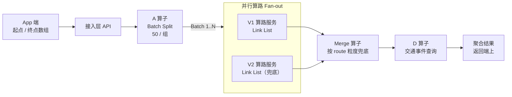
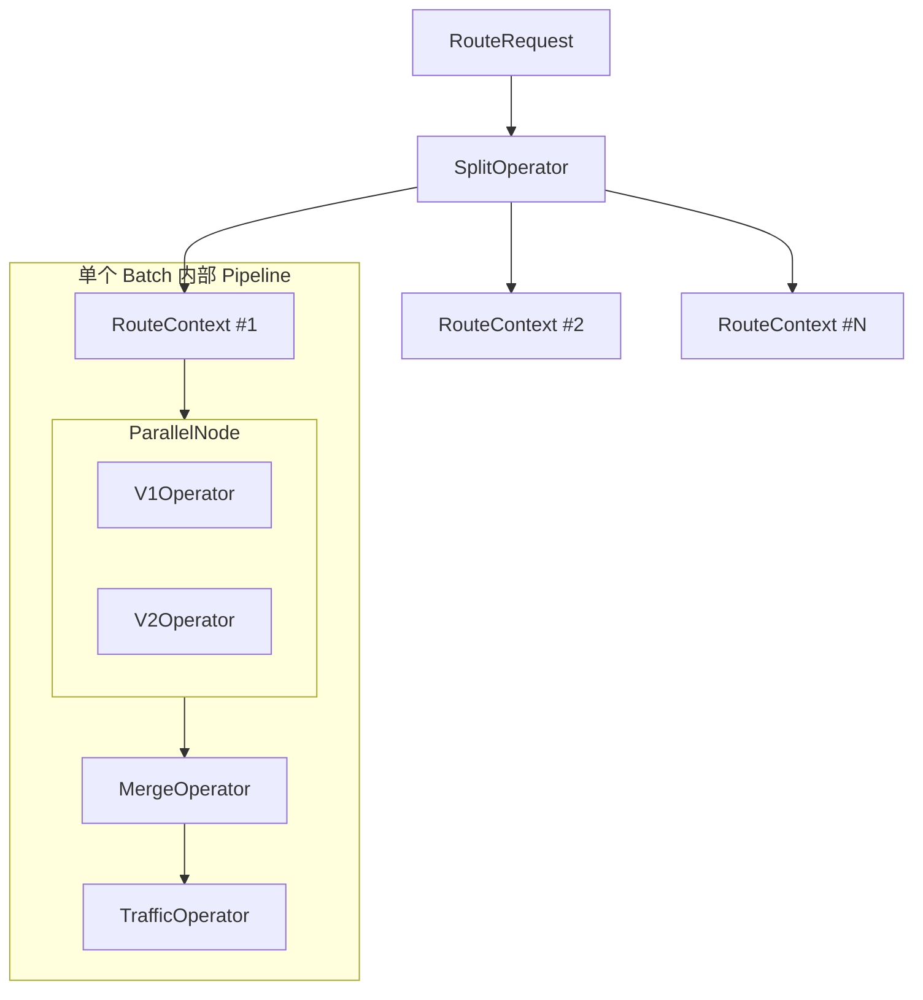

该文档记录作为接入层的项目
# 1 路径规划稳定性提升 
当前问题：   
针对导航规划路线某些场景有失败的case，返回给端上的路线有些是空的，需要兜底优化。
## 1.1 总体设计框架 



## 1.2 A算子批量拆分od对，每100个od对作为一次请求的上限
```
type SplitOperator struct {
    BatchSize int
}

func (o *SplitOperator) Execute(ctx context.Context, in *RouteContext) ([]*RouteContext, error) {
    var res []*RouteContext

    total := len(in.Origins)
    for i := 0; i < total; i += o.BatchSize {
        end := min(i+o.BatchSize, total)

        rc := &RouteContext{
            ReqID:   in.ReqID,
            BatchID: i / o.BatchSize,
            Origins: in.Origins[i:end],
            Dests:   in.Dests[i:end],
        }
        res = append(res, rc)
    }
    return res, nil
}
```
A 算子输出的是 多个 Context，后面是并行流水线
## 1.3 B / C 算子：并行算路（V1 & V2）,并行框架
```
type ParallelNode struct {
    Operators []Operator
}

func (p *ParallelNode) Execute(ctx context.Context, rc *RouteContext) {
    var wg sync.WaitGroup

    for _, op := range p.Operators {
        wg.Add(1)
        go func(op Operator) {
            defer wg.Done()
            _ = op.Execute(ctx, rc)
        }(op)
    }

    wg.Wait()
}
```
## 1.4 Merge 算子：结果兜底合并
按 link 粒度兜底，而不是整批兜底.最大化利用 V1 成功结果,V2 只作为补充策略。   

## 1.5 亮点 
亮点1 ： 从“串行链路”升级为「可并行的算子 DAG」    

亮点2 ： “部分失败可恢复”的兜底策略（不是简单重试）   
普通方案：   
retry   +  超时重试  +   整批 fallback   
我的方案：   
我们不是整批路线失败才兜底，而是 按单条 route / link list 粒度做合并，最大程度保留 V1 的成功结果，只对失败的部分使用 V2，这样既保证质量，也降低兜底成本。    

亮点3： go语言层面的设计
goroutine

WaitGroup

Context 超时控制

无共享数据，只写 Context  ，无锁设计

## 1.6 难点 
1 B，C算子的线程安全，数据一致性如何保证？   
B、C 算子并行写同一个 Context，不会有并发问题吗？    
不会。
Context 中的数据是 字段级别隔离的：
B 只写 V1Links
C 只写 V2Links
不存在并发写同一字段的情况，因此不需要额外锁。
后续考虑：
如果未来算子存在共享字段，会通过channel 汇聚，避免锁竞争。    

2 为什么不等 V1 失败再调 V2？  
因为 V1 失败往往不是“确定失败”，而是网络抖动、尾延迟。  
如果等失败再调 V2，会把不确定性叠加，导致整体 P99 急剧上升。   
一句话总结：
串行 fallback = 延迟叠加
并行 fallback = 概率对冲

# 2 
