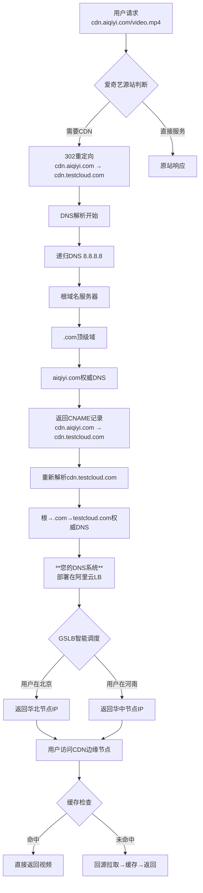
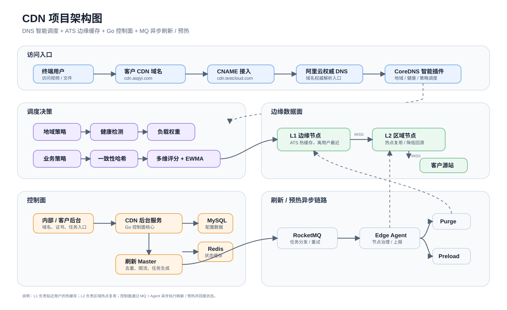
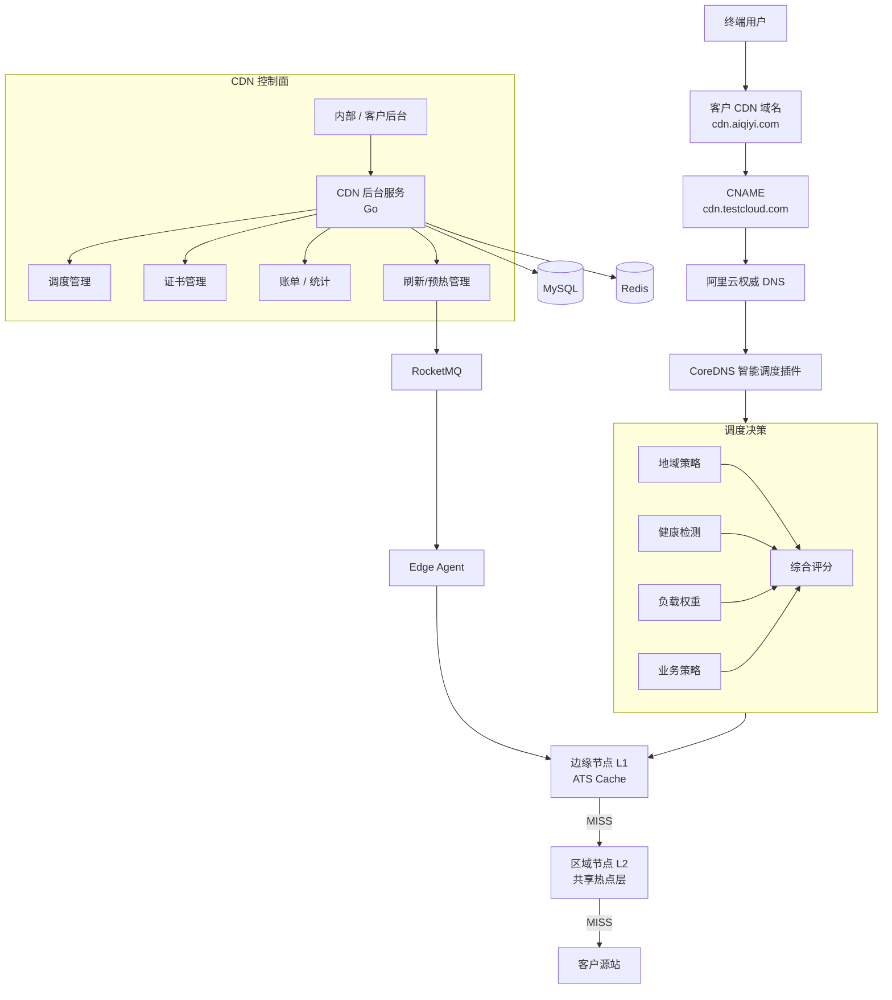
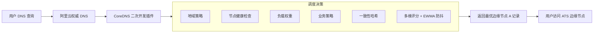
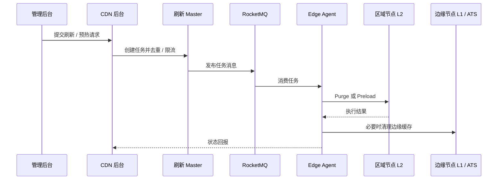
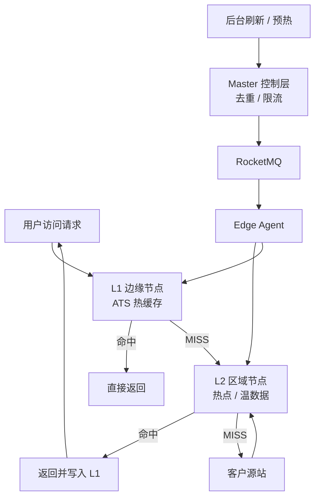

- [1 该系统分为几个模块，这个系统是干什么的？，架构图是什么？](#1-该系统分为几个模块这个系统是干什么的架构图是什么)
  - [1.1 这个系统是干什么的？](#11-这个系统是干什么的)
  - [1.2 该系统分为几个模块？](#12-该系统分为几个模块)
  - [1.3 架构图是什么？](#13-架构图是什么)
- [2 该系统完整的工作流程是什么？从用户发起请求下载到最后完成下载文件的过程](#2-该系统完整的工作流程是什么从用户发起请求下载到最后完成下载文件的过程)
  - [2.1 图片中重新解析 cdn.testcloud.com 这一步的理解](#21-图片中重新解析-cdntestcloudcom-这一步的理解)
- [3 dns解析到结果的流程解释，每一步骤](#3-dns解析到结果的流程解释每一步骤)
  - [3.1 第1步：从根域名服务器开始](#31-第1步从根域名服务器开始)
  - [3.2 第2步：查询 .com 顶级域服务器](#32-第2步查询-com-顶级域服务器)
  - [3.3 第3步：查询 aiqiyi.com的权威DNS服务器（关键步骤1）](#33-第3步查询-aiqiyicom的权威dns服务器关键步骤1)
  - [3.4 第3步的后续（关键步骤2）：获取CNAME记录](#34-第3步的后续关键步骤2获取cname记录)
  - [3.5 第4步：查询 testcloud.com的权威DNS服务器](#35-第4步查询-testcloudcom的权威dns服务器)
  - [3.6 第5步：获得最终IP](#36-第5步获得最终ip)
- [4 内部自研的dns系统是怎么开发部署的](#4-内部自研的dns系统是怎么开发部署的)
  - [4.1 内部自研智能dns解析系统介绍](#41-内部自研智能dns解析系统介绍)
  - [4.2 dns系统是怎么部署的](#42-dns系统是怎么部署的)
- [5 系统架构图](#5-系统架构图)
  - [5.1 项目总览图](#51-项目总览图)
  - [5.2 DNS 智能调度逻辑](#52-dns-智能调度逻辑)
  - [5.3 刷新 / 预热链路](#53-刷新--预热链路)
  - [5.4 分层缓存与一致性](#54-分层缓存与一致性)
  - [5.5 调度核心算法](#55-调度核心算法)
- [6 思考](#6-思考)
  - [6.1 为什么缓存文件在ats中，而不是nginx的cache中 ？](#61-为什么缓存文件在ats中而不是nginx的cache中-)
  - [6.2 只使用ats做热缓存，不使用Minio作为温缓存的原因是什么？](#62-只使用ats做热缓存不使用minio作为温缓存的原因是什么)


该文档把自己做过的cdn系统知识，架构整理
# 1 该系统分为几个模块，这个系统是干什么的？，架构图是什么？
## 1.1 这个系统是干什么的？
负责对接抖音，爱奇艺等客户，把他们的文件cache到我们的边缘节点，让用户访问我们的节点下载文件，以减轻对源站的下载带宽压力。
## 1.2 该系统分为几个模块？
cdn管理后台，主要负责域名管理、节点管理、调度管理、证书管理、账单模块、流量统计等核心能力建设。    
dns解析系统，二次开发k8s的coredns组件，为客户的下载文件请求解析我们公司的边缘节点的A记录IP地址，并且该dns解析服务是工作在dns权威域名服务器这一层。
## 1.3 架构图是什么？

# 2 该系统完整的工作流程是什么？从用户发起请求下载到最后完成下载文件的过程

CNAME记录的作用： 将流量从客户的域名（cdn.aiqiyi.com）引导至您公司的CDN调度系统（cdn.testcloud.com）
## 2.1 图片中重新解析 cdn.testcloud.com 这一步的理解
查询cdn.testcloud.com的权威DNS（关键步骤）： 现在，本地DNS服务器转而向管理 testcloud.com的权威DNS服务器（也就是您公司管理的DNS服务器，或者您CDN服务商提供的DNS系统）查询 cdn.testcloud.com的地址。

# 3 dns解析到结果的流程解释，每一步骤 
使用dig 模拟这个流程的各个环节每一步解析的过程和步骤
dig +trace cdn.aiqiyi.com    , 注意，域名解析的过程和中国人的习惯相反，不是从域名的左边到右边，而是根据   .   分隔符从右向左解析

## 3.1 第1步：从根域名服务器开始     
```
.			518400	IN	NS	a.root-servers.net.
.			518400	IN	NS	b.root-servers.net.
... (列出所有13个根服务器)
```
解读：DNS解析器首先查询根域名服务器（用点 .表示），询问 cdn.aiqiyi.com该找谁。根服务器告诉它，.com顶级域由哪些服务器负责（如 a.gtld-servers.net），并返回它们的IP地址。   

## 3.2 第2步：查询 .com 顶级域服务器    
```
com.		172800	IN	NS	a.gtld-servers.net.
... (从根服务器获得.com的NS记录)
```
解读：解析器接着去询问上一步得到的 .com服务器：“aiqiyi.com的权威DNS服务器是谁？” .com 服务器会返回管理 aiqiyi.com的权威DNS服务器列表。    

## 3.3 第3步：查询 aiqiyi.com的权威DNS服务器（关键步骤1）    
```
aiqiyi.com.		172800	IN	NS	ns1.aiqiyi.com.
aiqiyi.com.		172800	IN	NS	ns2.aiqiyi.com.
... (获得aiqiyi.com的权威服务器主机名)
```
解读：解析器找到了管理 aiqiyi.com的权威服务器（例如 ns1.aiqiyi.com）。接下来，它会向这些权威服务器查询 cdn.aiqiyi.com的记录。   

## 3.4 第3步的后续（关键步骤2）：获取CNAME记录
cdn.aiqiyi.com.	600	IN	CNAME	cdn.testcloud.com.
解读：这就是您问题中的记录！​ aiqiyi.com的权威服务器返回了一条CNAME记录，明确指出 cdn.aiqiyi.com只是 cdn.testcloud.com的一个别名。解析器意识到它需要重新开始查询 cdn.testcloud.com。

## 3.5 第4步：查询 testcloud.com的权威DNS服务器    
此时，解析器为了解析 cdn.testcloud.com，会重复第1到第3步的过程，但目标变成了 testcloud.com。它会：   
从根服务器找到 .com服务器。
从 .com服务器找到 testcloud.com的权威DNS服务器。    
这一步的输出会明确显示 testcloud.com的权威服务器是谁，例如：   
如果只想快速查看 testcloud.com的权威DNS服务器，而不关心完整的追踪过程，可以使用更简单的命令：dig ns testcloud.com    
```
testcloud.com.		86400	IN	NS	vip4.alidns.com.   
testcloud.com.		86400	IN	NS	vip3.alidns.com.    
vip3.alidns.com是 testcloud.com的【权威域名服务器】
```

## 3.6 第5步：获得最终IP
解析器最后向 testcloud.com的权威服务器查询 cdn.testcloud.com，并最终获得A记录（IP地址）。    
```
cdn.testcloud.com.	300	IN	A	192.0.2.1   
```

# 4 内部自研的dns系统是怎么开发部署的
## 4.1 内部自研智能dns解析系统介绍
二次开发coredns，手写一个新的插件，重写serverdns方法，最终在plugin中引入该插件，编译coredns，开发53端口，进行解析    
流量进入到serverdns时，从request中获取来源ip地址，使用内部的ip库，可以解析出该来源ip的区域（比如华北），然后调用cdn管理后台提供的rpc接口，查询该地区下部署的agent节点的活跃ip，作为A记录返回给用户     


## 4.2 dns系统是怎么部署的
部署在阿里云服务器上，购买了阿里云的公网ip作为入口，k8s上使用loadblance的service部署方式，轮训机制，   
没有使用clusterip，因为这个只能k8s集群内部调用，   
没有使用nodeport方式，这个的端口限制必须是大于30000，而我们的dns默认端口是53，不方便用户使用    

# 5 系统架构图
整体采用 DNS 智能调度 + 边缘缓存的数据面架构。

用户流量先经过客户域名 CNAME 到 CDN 调度域名，再由阿里云权威 DNS / CoreDNS 智能调度层返回最优边缘节点 IP。边缘节点使用 ATS 作为缓存引擎，命中则直接返回，未命中则按 L1 → L2 → 源站链路回源。

控制面基于 Go 实现，负责域名、节点、调度、证书、账单、流量统计、刷新 / 预热等能力，数据存储使用 MySQL + Redis。刷新与预热任务由 Master 统一生成，通过 RocketMQ 分发给 Edge Agent，Agent 操作本地 ATS Cache 并回报执行状态。

整理后的项目图已重新绘制为 SVG，可导入 Figma 继续编辑：`../image/cdn/cdn-architecture.svg`。

## 5.1 项目总览图





## 5.2 DNS 智能调度逻辑



核心流程：

1. 客户域名通过 CNAME 接入 CDN 调度域名。
2. CoreDNS 根据地域、健康度、负载、业务策略和一致性哈希选择节点。
3. 用户访问 L1 ATS，命中直接返回，未命中再访问 L2 或源站。
4. 控制面通过 Agent 管理边缘节点，刷新 / 预热任务通过 MQ 异步下发。

## 5.3 刷新 / 预热链路



## 5.4 分层缓存与一致性



刷新走“后台 → Master → MQ → Agent → L2 / L1”，核心动作是删除缓存，不是主动更新缓存。

预热优先落到 L2，避免把所有 L1 节点打满。用户访问时如果 L1 miss，则从 L2 命中并回填 L1，减少直接回源。

最终一致性依赖三层兜底：

1. Purge 主动失效。
2. TTL 到期自动淘汰。
3. 懒更新，只在用户真实访问时回源并刷新缓存。

## 5.5 调度核心算法

调度系统采用两级调度：全局调度先选区域，区域调度再选节点。这样可以降低单次计算复杂度，提高扩展性，并支持跨区域容灾。

节点状态由 Agent 持续上报，主要包括 RTT、QPS、CPU / Load、错误率、超时率等指标。调度决策会结合健康检测、配置权重、灰度策略和业务策略。

多维评分模型：

```text
score = 0.4 * 延迟 + 0.3 * 负载 + 0.2 * 错误率 + 0.1 * 成本
```

EWMA 用来降低实时指标抖动：

```text
新值 = 30% 当前值 + 70% 历史值
```

一致性哈希用于让同一个文件尽量落在稳定的一组候选节点上，提高缓存命中率并减少回源。
# 6 思考
## 6.1 为什么缓存文件在ats中，而不是nginx的cache中 ？
缓存文件  不放在  Nginx 本地磁盘里的原因： 因为 Nginx 的 cache 目录增长难控、inode 爆炸、清理不灵活。     
选择ats的考量：   
Apache Traffic Server (ATS)，出身大流量 Web Cache
支持磁盘 + 内存双级缓存       
更成熟的存储管理和淘汰机制       
可以作为大型 CDN 的边缘缓存引擎       
ATS 在 CDN 场景中比 Varnish 更稳定、可扩展       
适合高并发、大文件场景         

## 6.2 只使用ats做热缓存，不使用Minio作为温缓存的原因是什么？

规模小不需要使用minio，如果后续规模大，就要使用Minio，可以减少回源次数。   
ATS 本身就是一个成熟的边缘缓存系统，可以独立承担缓存职责。    
我们在设计时并没有一开始就引入对象存储，而是优先保证边缘节点的简单性和稳定性。     
在流量规模扩大、回源成本和跨节点缓存复用成为瓶颈后，才会引入 MinIO 作为共享缓存层，用于热点内容复用和冷热分层。   
MinIO 不是边缘节点,部署在中心机房，网络延迟远高于边缘 ATS，客户访问的永远只能是ATS。    
```
Client
  ↓
ATS（边缘缓存）
  ↓ cache miss
MinIO（共享缓存池 / 温数据）
  ↓ miss
源站

```
