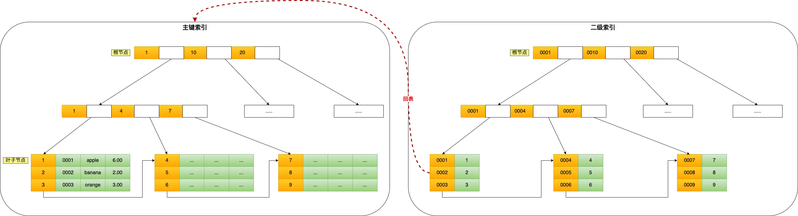

- [MySQL 面试题](#mysql-面试题)
- [1.1 索引有哪些类型](#11-索引有哪些类型)
- [1.2 聚簇索引和非聚簇索引的区别是什么？为什么 MySQL 要用聚簇索引？](#12-聚簇索引和非聚簇索引的区别是什么为什么-mysql-要用聚簇索引)
- [1.3 回表是什么？覆盖索引如何减少回表？](#13-回表是什么覆盖索引如何减少回表)
- [1.4 MySQL 的自增主键为什么会导致写热点？怎么优化？](#14-mysql-的自增主键为什么会导致写热点怎么优化)
- [1.5 MVCC 是如何实现快照读的？](#15-mvcc-是如何实现快照读的)
- [1.6 MySQL 死锁常见场景有哪些？如何排查？](#16-mysql-死锁常见场景有哪些如何排查)
- [1.7 InnoDB 的行锁、间隙锁、临键锁分别是什么？](#17-innodb-的行锁间隙锁临键锁分别是什么)
- [1.8 Count(\*) 为什么会慢？](#18-count-为什么会慢)
- [1.9 你怎么做分库分表？如何避免跨库查询？](#19-你怎么做分库分表如何避免跨库查询)
- [1.10 分布式 ID 方案有哪些？雪花算法的缺点是什么？](#110-分布式-id-方案有哪些雪花算法的缺点是什么)
- [1.11 如何实现 Redis + MySQL 数据的最终一致性？](#111-如何实现-redis--mysql-数据的最终一致性)
  - [1.11.1 为什么会产生不一致？](#1111-为什么会产生不一致)
  - [1.11.2 解决方案 1：Cache Aside（旁路缓存，最推荐）](#1112-解决方案-1cache-aside旁路缓存最推荐)
  - [1.11.3 延时双删策略](#1113-延时双删策略)
  - [1.11.4 异步消息队列保证最终一致性](#1114-异步消息队列保证最终一致性)
- [1.12 MySQL 主从延迟有哪些解决方案？](#112-mysql-主从延迟有哪些解决方案)
- [1.13 如何设计一个可扩展的索引策略？](#113-如何设计一个可扩展的索引策略)
- [1.14 大表字段变更如何做到不停机？](#114-大表字段变更如何做到不停机)

# MySQL 面试题
# 1.1 索引有哪些类型
按照数据结构分类：B+tree索引，hash索引，全文索引    
按照物理存储分类：聚簇索引（主键索引），非聚簇索引（二级索引）  
按照字段特性分类：主键索引，唯一索引，普通索引，联合索引    
按照字段个数分类：单列索引，联合索引    

# 1.2 聚簇索引和非聚簇索引的区别是什么？为什么 MySQL 要用聚簇索引？
聚簇索引的叶子节点存储的是实际数据，所有记录都完整的存储在聚簇索引的叶子节点里边  
非聚簇索引的叶子节点存储的是主键值，而不是实际数据  
 

为什么 MySQL 要用聚簇索引？   
查到主键就是查到全部数据，不需要回表增加时间复杂度  
# 1.3 回表是什么？覆盖索引如何减少回表？
可以使用联合索引，将不会在检索主键索引，避免回表    
# 1.4 MySQL 的自增主键为什么会导致写热点？怎么优化？

# 1.5 MVCC 是如何实现快照读的？

# 1.6 MySQL 死锁常见场景有哪些？如何排查？

# 1.7 InnoDB 的行锁、间隙锁、临键锁分别是什么？

# 1.8 Count(*) 为什么会慢？

高级题

# 1.9 你怎么做分库分表？如何避免跨库查询？

# 1.10 分布式 ID 方案有哪些？雪花算法的缺点是什么？

# 1.11 如何实现 Redis + MySQL 数据的最终一致性？
## 1.11.1 为什么会产生不一致？
因为 MySQL 是最终存盘，Redis 是缓存层，两者不是原子操作：   
写 MySQL 成了，但写 Redis 失败   
写 Redis 成了，但 MySQL 回滚了   
Redis 中的数据过期、被驱逐   
高并发下缓存与数据库并发修改   
多服务同时更新同一条记录   
## 1.11.2 解决方案 1：Cache Aside（旁路缓存，最推荐）
读：     
读 Redis     
没有 → 查 MySQL → 写回 Redis → 返回        
写：     
写 MySQL（主存）     
删除缓存（不是更新缓存！）     

为什么删除而不是更新？        
删除是幂等的，不会发生 “写旧值”     
高并发写时，更新缓存可能被覆盖     
📌 删除缓存是业界标准，尤其适用于用户资料、订单、配置等读多写少场景。     

优点     
逻辑简单，性能高     
Redis 挂掉仍能访问 MySQL     
高并发下较稳定     

缺点 ：       
写 → 删除缓存 没有事务，依旧会有极小的不一致窗口   
## 1.11.3 延时双删策略
写操作：   
删除缓存   
写 MySQL   
延迟 X ms 后再次删除缓存   
第二次删除避免并发请求在写入过程中把旧数据读入缓存。   
延时一般 100ms–500ms（根据 RT 决定）。   
缺点：不完全可靠，但能显著降低不一致概率   
## 1.11.4 异步消息队列保证最终一致性
流程：
1 写 MySQL 成功     
2 发送 MQ 消息（保证至少一次投递）    
3 消费者收到消息 → 删除 Redis 缓存
4 如果失败 → 重试 / 死信队列补偿    

适合：    
订单    
账号余额    
积分 ｜ 状态流转    
库存扣减    

优点：    
基本能做到最终一致    
可靠性高    

缺点：    
架构复杂    
需处理消息重复、延迟、幂等    
# 1.12 MySQL 主从延迟有哪些解决方案？

# 1.13 如何设计一个可扩展的索引策略？

# 1.14 大表字段变更如何做到不停机？
